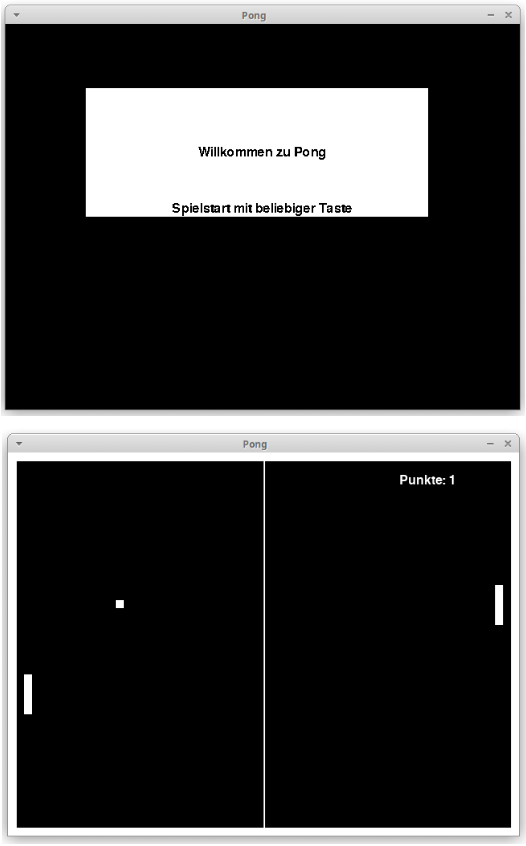

# Pong-Pygame

**Simple implementation of the game "Pong" with pygame**

### `Used Versions`
python: `v.3.9.0` \
pygame: `v.2.0.1`

### `Version 1:` Pong with mouse controls
**Example usage:** \
`python3 pongV1.py` \
*or* \
Run the `main` method of `pongV1.py`

### `Version 2:` Pong with keyboard controls
**Example usage:** \
`python3 pongV2.py` \
*or* \
Run the `main` method of `pongV2.py`